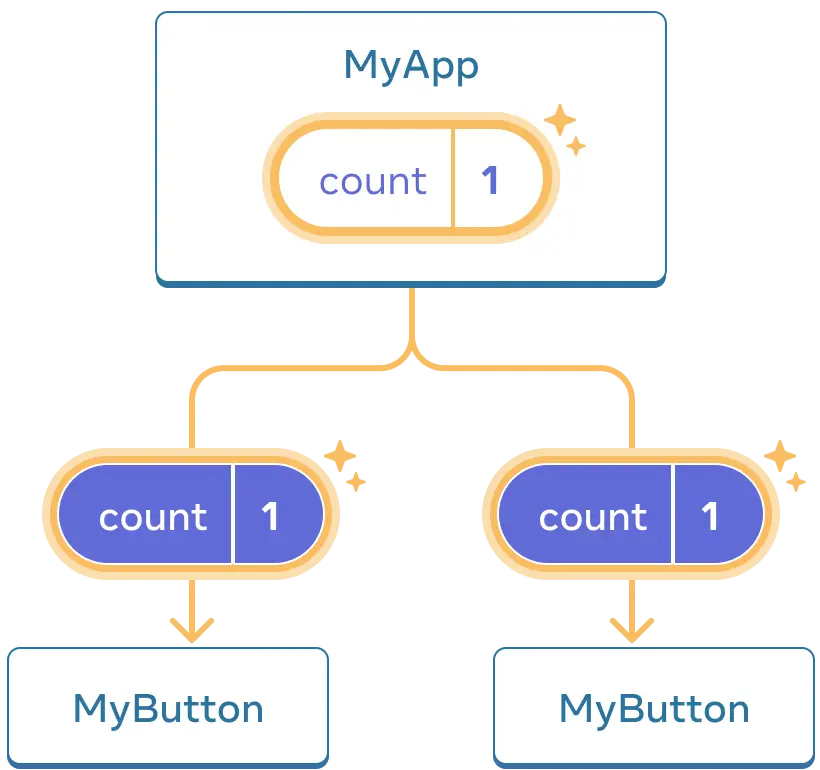

# React.js
React is the library for web and native user interfaces. Build user interfaces out of individual pieces called components written in JavaScript.

### Components
A component is a piece of the UI (user interface) that has its own logic and appearance. A component can be as small as a button, or as large as an entire page.

React component names must always start with a capital letter, while HTML tags must be lowercase. 
```sh
<MyButton />
```

### Writing markup with JSX
JSX is stricter than HTML. You have to close tags like `<br />`. Your component also can’t return multiple JSX tags. You have to wrap them into a shared parent, like a `<div>...</div>` or an empty `<>...</>` wrapper

Tool to convert HTML to JSX: https://transform.tools/html-to-jsx

### Adding styles
In React, you specify a CSS class with `className`. It works the same way as the HTML class attribute. 

```sh

```

### Displaying data
JSX lets you put markup into JavaScript. Curly braces let you “escape back” into JavaScript so that you can embed some variable from your code and display it to the user. For example, this will display `{user.name}`

You can also “escape into JavaScript” from JSX attributes, but you have to use curly braces instead of quotes. For example, className="avatar" passes the "avatar" string as the CSS class, but `src={user.imageUrl}` reads the JavaScript user.imageUrl variable value, and then passes that value as the src attribute:

```sh

```

### Conditional rendering
In React, there is no special syntax for writing conditions. Instead, you’ll use the same techniques as you use when writing regular JavaScript code. For example, you can use an if statement to conditionally include JSX:

```sh
let content;
if (isLoggedIn) {
  content = <AdminPanel />;
} else {
  content = <LoginForm />;
}
return (
  <div>
    {content}
  </div>
);
```

If you prefer more compact code, you can use the conditional ? operator. Unlike if, it works inside JSX:

```sh
<div>
  {isLoggedIn ? (
    <AdminPanel />
  ) : (
    <LoginForm />
  )}
</div>
```

When you don’t need the else branch, you can also use a shorter logical && syntax:

```sh
<div>
  {isLoggedIn && <AdminPanel />}
</div>
```

### Rendering lists
You will rely on JavaScript features like for loop and the array map() function to render lists of components.

```sh
const listItems = products.map(product =>
  <li key={product.id}>
    {product.title}
  </li>
);

return (
  <ul>{listItems}</ul>
);
```

### Responding to events
You can respond to events by declaring event handler functions inside your components:

```sh
function MyButton() {
  function handleClick() {
    alert('You clicked me!');
  }

  return (
    <button onClick={handleClick}>
      Click me
    </button>
  );
}
```

Notice how `onClick={handleClick}` has no parentheses at the end! Do not call the event handler function: you only need to pass it down. React will call your event handler when the user clicks the button.

### Updating the screen
Often, you’ll want your component to “remember” some information and display it. For example, maybe you want to count the number of times a button is clicked. To do this, add state to your component.

```sh
import { useState } from 'react';
```

You’ll get two things from useState: the current state (count), and the function that lets you update it (setCount). You can give them any names, but the convention is to write `[something, setSomething]`.

```sh
const [count, setCount] = useState(0);
```

### Using Hooks
Functions starting with use are called Hooks. `useState` is a built-in Hook provided by React.

### Sharing data between components

`props` is an information passed down to child component. in below example `MyApp` component contains the `count` state and the `handleClick` event handler, and passes both of them down as props to each of the buttons.



```sh
export default function MyApp() {
  const [count, setCount] = useState(0);

  function handleClick() {
    setCount(count + 1);
  }

  return (
    <div>
      <h1>Counters that update together</h1>
      <MyButton count={count} onClick={handleClick} />
      <MyButton count={count} onClick={handleClick} />
    </div>
  );
}
```

Finally, change `MyButton` to read the props you have passed from its parent component:

```sh
function MyButton({ count, onClick }) {
  return (
    <button onClick={onClick}>
      Clicked {count} times
    </button>
  );
}
```

The `onClick` handler fires event from child component by passing new count value as a prop to it's parent. This is called "lifting state up". this shows how data is shared between the components.

### The build tools

**Vite**
[Vite](https://vite.dev/) is a build tool that aims to provide a faster and leaner development experience for modern web projects.

`npx vite@latest —template react`

**Parcel**
[Parcel](https://parceljs.org/) combines a great out-of-the-box development experience with a scalable architecture that can take your project from just getting started to massive production applications.

`npm install —save-dev parcel`

### Rendering strategies

**Single-page apps (SPA)** load a single HTML page and dynamically updates the page as the user interacts with the app. SPAs are fast and responsive, but they can have slower initial load times. SPAs are the default architecture for most build tools.

**Streaming Server-side rendering (SSR)** renders a page on the server and sends the fully rendered page to the client. SSR can improve performance, but it can be more complex to set up and maintain than a single-page app. With the addition of streaming, SSR can be very complex to set up and maintain.

**Static site generation (SSG)** generates static HTML files for your app at build time. SSG can improve performance, but it can be more complex to set up and maintain than server-side rendering.

**React Server Components (RSC)** lets you mix build-time, server-only, and interactive components in a single React tree. RSC can improve performance, but it currently requires deep expertise to set up and maintain.See [Parcel’s RSC examples](https://github.com/parcel-bundler/rsc-examples).

### Typescript support in React app
- You can get full React Web support by adding `@types/react` and `@types/react-dom` to your project.

`npm install @types/react @types/react-dom`

